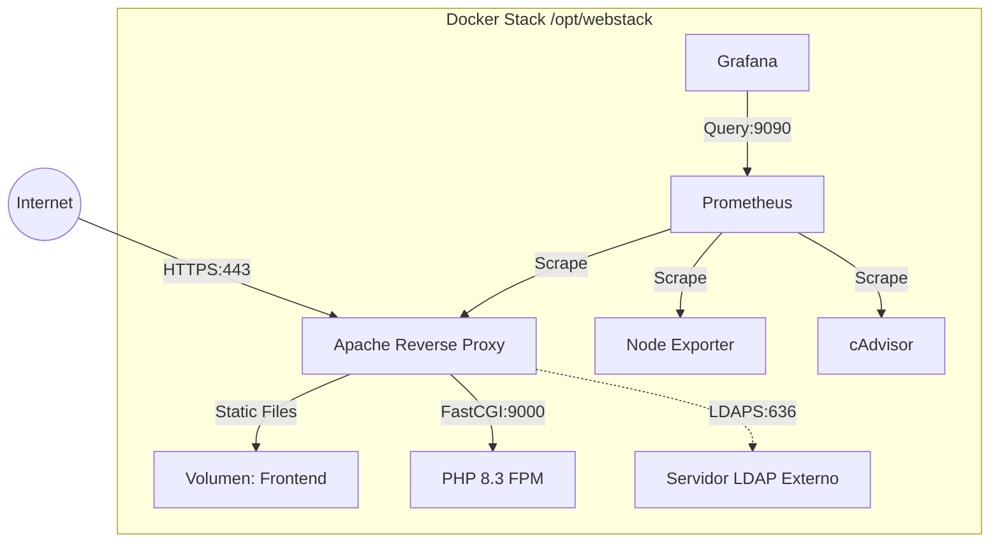

# ☁️ Proyecto Cloud de Despliegue Automatizado (Web + LDAP + Monitorización)

Este proyecto implementa una infraestructura robusta y escalable en **AWS**, utilizando las mejores prácticas de **DevOps**. Combina **Infraestructura como Código (IaC)**, gestión de configuración y contenedores para ofrecer un servicio web seguro y monitorizado.

El despliegue es **100% automatizado** mediante GitHub Actions, asegurando consistencia y rapidez en cada actualización.

---

## 📖 Tabla de Contenidos

1. [Arquitectura del Sistema](#-arquitectura-del-sistema)
2. [Tecnologías Utilizadas](#-tecnologías-utilizadas)
3. [Estructura del Repositorio](#-estructura-del-repositorio)
4. [Requisitos Previos](#-requisitos-previos)
5. [Flujo de Trabajo (CI/CD)](#-flujo-de-trabajo-cicd)
6. [Guía de Despliegue Manual](#-guía-de-despliegue-manual)
7. [Monitorización y Métricas](#-monitorización-y-métricas)
8. [Solución de Problemas (Troubleshooting)](#-solución-de-problemas)
9. [Registro de Cambios (Changelog)](#-registro-de-cambios-changelog)

---

## 🏗 Arquitectura del Sistema

El sistema utiliza una arquitectura de microservicios contenerizados sobre instancias EC2.

### Flujo de Tráfico

1.  **HTTPS (443)**: Todo el tráfico de entrada llega a Apache.
    - Se fuerza redirección automática de HTTP (80) a HTTPS (443).
    - **Certificados SSL Autosignados**: Generados automáticamente en el servidor durante el despliegue para máxima seguridad y simplicidad.
2.  **Enrutamiento**:
    - **Frontend (/):** Sirve contenido estático HTML/JS desde un volumen Docker.
    - **Backend (/phpapp):** Redirige peticiones `.php` al contenedor **PHP-FPM** vía protocolo FastCGI (puerto 9000).
    - **Admin (/admin):** Integra autenticación **LDAP/LDAPS** para proteger el acceso.
3.  **Observabilidad**:
    - **Prometheus** recolecta métricas cada 15s.
    - **Grafana** visualiza el estado del sistema.



---

## 🛠 Tecnologías Utilizadas

| Tecnología | Propósito |
|------------|-----------|
| **AWS EC2** | Infraestructura de cómputo (Ubuntu 24.04). |
| **Docker Compose** | Orquestación de contenedores (Apache, PHP, Monitoring). |
| **Ansible** | Aprovisionamiento y configuración de servidores. Uso de **Jinja2** para templating. |
| **GitHub Actions** | Pipeline de CI/CD para despliegue continuo. |
| **Apache 2.4** | Servidor web y Proxy Inverso con soporte `mod_authnz_ldap`. |
| **Prometheus/Grafana** | Stack de monitorización líder en la industria. |

---

## 📂 Estructura del Repositorio

| Ruta | Descripción |
|------|-------------|
| `.github/workflows/` | **CI/CD**: Define el pipeline de despliegue (`ansible-deploy.yml`). |
| `ansible-web/` | **Automatización**: Playbooks, roles y templates. |
| ├── `host.ini` | Inventario de servidores. |
| ├── `tasks/main.yml` | Lógica principal (Clean -> Gen SSL -> Template -> Deploy). |
| └── `templates/` | Plantillas Jinja2 (`env.j2`, `webstack.conf.j2`). |
| `apache/` | **Configuración Web**: Dockerfile personalizado. |
| `apps/` | **Código**: Aplicaciones Frontend y PHP. |
| `docker-compose.yml` | **Definición del Stack**: Servicios, redes y volúmenes. |

---

## 🚀 Requisitos Previos

Para implementar este proyecto desde cero necesitas:

1.  **Secretos de GitHub** (Configurados en Settings > Secrets):
    - `ANSIBLE_PRIVATE_KEY`: Clave SSH privada (`.pem`) con acceso root/sudo a las instancias.
    - Credentials de AWS (si usas Terraform en el pipeline): `AWS_ACCESS_KEY_ID`, `AWS_SECRET_ACCESS_KEY`.
2.  **Puertos Abiertos (Security Groups)**:
    - `22`: SSH (Solo IPs autorizadas).
    - `80/443`: Tráfico Web.
    - `3000`: Acceso a Grafana.
    - `9090`: Acceso a Prometheus (opcional, para debug).

---

## 🔄 Flujo de Trabajo (CI/CD)

Cada vez que haces un **Push** a la rama `main`:

1.  **Pre-Procesamiento**: GitHub Actions instala Ansible y configura la clave SSH.
2.  **Ejecución de Ansible**:
    - **Limpieza**: Borra completamente `/opt/webstack` y las imágenes locales para asegurar un entorno **inmaculado**.
    - **Infraestructura**: Recrea los directorios necesarios.
    - **SSL**: Genera un nuevo certificado SSL autosignado directamente en el servidor.
    - **Templating**: Inyecta las variables de entorno en la configuración de Apache.
    - **Build & Deploy**: Construye las imágenes "frescas" (con el nuevo certificado) y levanta el stack.
    - **Verificación**: Espera (hasta 300s) a que el puerto 443 responda.

---

## 🛠 Guía de Despliegue Manual

Si necesitas desplegar localmente sin GitHub Actions:

```bash
# 1. Instalar Ansible
sudo apt update && sudo apt install -y ansible

# 2. Configurar variables (opcional, o editar vars/main.yml)
export ANSIBLE_HOST_KEY_CHECKING=False

# 3. Ejecutar Playbook
ansible-playbook -i ansible-web/host.ini ansible-web/tasks/main.yml \
  --private-key ~/.ssh/tu-clave.pem
```

---

## 📈 Monitorización y Métricas

Accede a **Grafana** en `http://<IP-SERVIDOR>:3000`.
- **Usuario**: `admin`
- **Contraseña**: `admin` (se recomienda cambiar al primer inicio).

Métricas disponibles:
- **Uso de CPU/Memoria** (vía cAdvisor).
- **Tráfico de Red** (vía Node Exporter).
- **Estado de Contenedores**.
---
**Proyecto Cloud Computing** | Desarrollado con ❤️ y Automatización.
