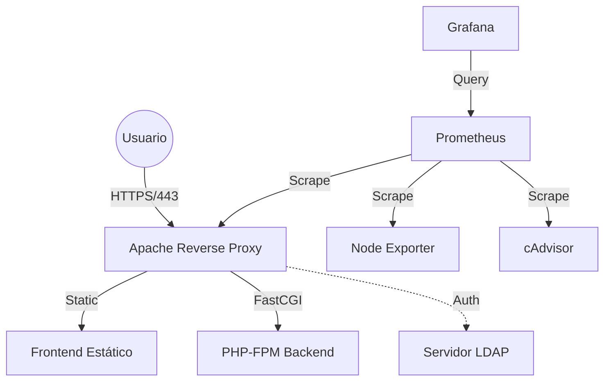

# ☁️ Proyecto Cloud de Despliegue Automatizado (Web + LDAP + Monitorización)

Este proyecto implementa una infraestructura robusta y escalable en **AWS**, utilizando las mejores prácticas de **DevOps**. Combina **Infraestructura como Código (IaC)**, gestión de configuración y contenedores para ofrecer un servicio web seguro y monitorizado.

---

## 📖 Tabla de Contenidos

1. [Arquitectura del Sistema](#-arquitectura-del-sistema)
2. [Tecnologías Utilizadas](#-tecnologías-utilizadas)
3. [Estructura del Repositorio](#-estructura-del-repositorio)
4. [Requisitos Previos](#-requisitos-previos)
5. [Guía de Despliegue Automático](#-guía-de-despliegue-automático-github-actions)
6. [Guía de Despliegue Manual](#-guía-de-despliegue-manual)
7. [Solución de Problemas (Troubleshooting)](#-solución-de-problemas)

---

## 🏗 Arquitectura del Sistema

El sistema está diseñado para ser modular. El tráfico fluye de la siguiente manera:

1.  **Usuario** accede vía HTTPS (Puerto 443).
2.  **Apache** (Contenedor) recibe la petición.
    - Si es contenido estático -> Sirve desde `./apps/frontend`.
    - Si es PHP -> Pasa la petición a **PHP-FPM** (Contenedor) vía protocolo FastCGI.
    - Si es `/admin` -> Solicita autenticación contra **LDAP**.
3.  **Monitorización**:
    - **Prometheus** recolecta métricas de Apache, contenedores (cAdvisor) y del nodo (Node Exporter).
    - **Grafana** visualiza estas métricas en cuadros de mando.



---

## 🛠 Tecnologías Utilizadas

- **AWS EC2**: Servidores virtuales donde se ejecuta el stack.
- **Docker & Docker Compose**: Orquestación de contenedores. Permite levantar todo el entorno con un solo comando.
- **Ansible**: Automatización de la configuración. Se conecta a los servidores, instala Docker, copia los archivos y levanta los servicios.
- **GitHub Actions**: CI/CD. Detecta cambios en el código y lanza Ansible automáticamente.
- **Apache + PHP-FPM**: Stack web clásico pero desacoplado en microservicios.
- **Prometheus + Grafana**: Stack estándar de la industria para observabilidad.

---

## 📂 Estructura del Repositorio

Entender dónde está cada archivo es clave para operar el sistema:

| Ruta | Descripción |
|------|-------------|
| `.github/workflows/ansible-deploy.yml` | **Pipeline CI/CD**. Define los pasos para conectar a AWS y ejecutar Ansible. |
| `ansible-web/` | **Corazón de la Automatización**. |
| ├── `host.ini` | Inventario (IPs de tus servidores). |
| ├── `tasks/main.yml` | Pasos del despliegue (Copiar archivos, Pull, Build, Up). |
| └── `templates/env.j2` | Plantilla para generar el archivo `.env` con secretos. |
| `apache/` | **Configuración Web**. Vhosts y certificados SSL. |
| `apps/` | **Código Fuente**. Aquí pones tu HTML y PHP. |
| `docker-compose.yml` | **Orquestador**. Define qué contenedores se levantan y cómo se comunican. |

---

## 🚀 Requisitos Previos

Antes de empezar, asegúrate de tener:

1.  **Instancias AWS**: Servidores Ubuntu 24.04 con acceso SSH.
2.  **Puertos Abiertos (Security Groups)**:
    - `22` (SSH) - Solo para admin/GitHub Actions.
    - `80` (HTTP) y `443` (HTTPS) - Acceso Web.
    - `3000` (Grafana) y `9090` (Prometheus) - Monitorización.
3.  **Secretos en GitHub**:
    Ve a `Settings > Secrets and variables > Actions` y añade:
    - `ANSIBLE_PRIVATE_KEY`: El contenido de tu archivo `.pem`.

---

## ⚙ Guía de Despliegue Automático (GitHub Actions)

Es el método recomendado.

1.  Modifica cualquier archivo (ej. `apps/frontend/index.html`).
2.  Haz un **Commit** y **Push** a la rama `main`.
3.  Ve a la pestaña **Actions** en GitHub.
4.  Verás un flujo de trabajo ejecutándose que:
    - Instala Ansible.
    - Se conecta a tus servidores EC2.
    - Actualiza el código y reinicia los contenedores.

---

## 🛠 Guía de Despliegue Manual

Útil para depuración o si no quieres usar GitHub Actions.

1.  Instala Ansible: `sudo apt install ansible`.
2.  Configura tu clave SSH (ej. `clave.pem`).
3.  Ejecuta el playbook desde la raíz del proyecto:

```bash
# Deshabilita la comprobación estricta de host (opcional, para evitar "yes/no")
export ANSIBLE_HOST_KEY_CHECKING=False

# Ejecuta el playbook
ansible-playbook -i ansible-web/host.ini ansible-web/tasks/main.yml \
  --private-key /ruta/a/tu/clave.pem \
  --extra-vars "domain=midominio.com le_email=admin@test.com"
```

---

## ❓ Solución de Problemas

### Error: `AnsibleActionFail: Could not find or access ...`
- **Causa**: Ansible no encuentra los archivos locales para copiarlos al servidor.
- **Solución**: Asegúrate de que las rutas en `main.yml` usan `../../` para referenciar la raíz del proyecto.

### Error: `Docker Compose ... non-zero return code`
- **Causa**: Timeout al descargar imágenes o error en la construcción.
- **Solución**: El playbook ahora divide el proceso en `pull`, `build` y `up` para identificar dónde falla. Revisa los logs de la Action para ver cuál paso falló.

### Apache no inicia (CrashLoopBackOff)
- **Causa**: Faltan certificados SSL.
- **Solución**: Asegúrate de que existen `apache/ssl/fullchain.pem` y `apache/ssl/privkey.pem`. Si no, genéralos con `openssl` (ver pasos anteriores).

---
Autor: Héctor | Proyecto Cloud Computing
